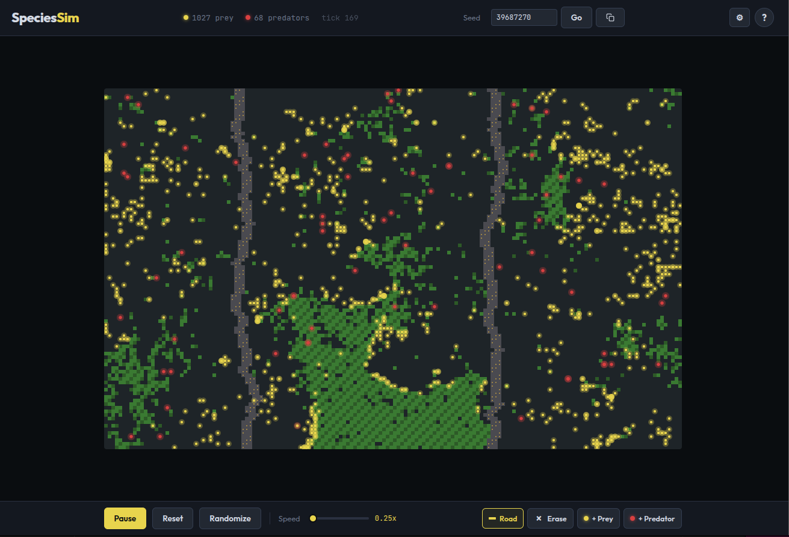

# SpeciesSim

A real-time ecosystem simulator that visualizes predator-prey dynamics on a grid world. Watch populations rise and fall as creatures hunt, forage, reproduce, and die — all driven by energy, vision, and environmental factors.

Built with TypeScript and HTML5 Canvas. No frameworks, no dependencies.

[](https://iloire.github.io/species-simulator/)




## How It Works

**Prey** (yellow) eat grass to gain energy, flee from nearby predators, and reproduce when they have enough energy. **Predators** (red) hunt prey, move faster, but starve quickly without food. Populations self-regulate through classic Lotka-Volterra dynamics — predator booms follow prey booms, then crash when food runs out.

### World Elements

| Element | Description |
|---------|-------------|
| **Grass** | Grows randomly on empty cells. Food source for prey. |
| **Roads** | Block grass growth, fragment habitats. 30% kill chance for creatures crossing. |
| **Empty** | Open terrain — grass can grow here. |

### Creature Mechanics

- **Energy** — gained from eating, spent on living. Starvation = death.
- **Speed** — determines movement steps per tick (predators are faster).
- **Vision** — radius for finding food or spotting threats.
- **Reproduction** — creatures split energy to spawn offspring when above a threshold.
- **Hunt cooldown** — predators must wait between kills.
- **Catch chance** — hunts don't always succeed.
- **Grass cover** — prey hiding in grass reduce predator vision range.
- **Alarm** — when a prey is killed, nearby prey panic and flee.

## Getting Started

```bash
npm install
npm run dev
```

Open `http://localhost:5173` in your browser.

## Controls

| Control | Action |
|---------|--------|
| **Play / Pause** | Start or freeze the simulation |
| **Randomize** | Reset the world with fresh creatures and grass |
| **Speed** | 1x – 10x simulation speed |
| **Road tool** | Draw roads on the grid |
| **Erase tool** | Remove roads |
| **+Prey / +Predator** | Click to spawn creatures |
| **Settings** | Tune 20+ parameters (energy, speed, vision, reproduction, etc.) |

Settings persist across sessions via localStorage.

## Project Structure

```
src/
├── main.ts          # App init, UI, event handlers, game loop
├── simulation.ts    # Core engine — creature AI, grass, world state
├── renderer.ts      # Canvas rendering
├── chart.ts         # Population history graph
├── types.ts         # TypeScript interfaces and config
└── style.css        # Dark theme, Outfit + JetBrains Mono fonts
```

## Build

```bash
npm run build       # Production bundle
npm run preview     # Preview the build locally
```
